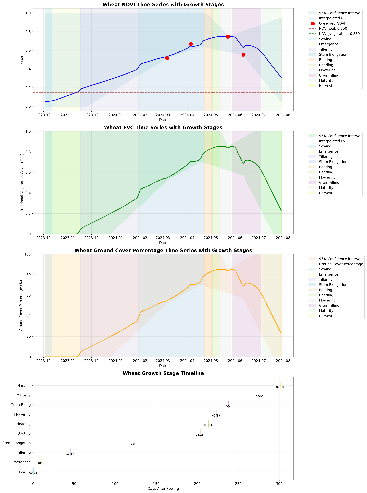

# Wheat Phenology Analysis Tool

A comprehensive remote sensing-based tool for estimating wheat phenological growth stages using NDVI time series data. This tool combines agronomic knowledge with advanced interpolation techniques to predict daily growth stages throughout the wheat growing season, and includes **Fractional Vegetation Cover (FVC)** and **Ground Cover Percentage** calculations.

## 📋 Table of Contents

- [🌾 Overview](#-overview)
- [📊 Data Requirements](#-data-requirements)
- [🌱 FVC & Ground Cover Percentage](#-fvc--ground-cover-percentage)
- [🔬 Scientific Basis & Assumptions](#-scientific-basis--assumptions)
- [🔄 Processing Pipeline](#-processing-pipeline)
- [📊 Workflow Map](#-workflow-map)
- [📈 Output Files](#-output-files)
- [⚠️ Limitations](#️-limitations)
- [🚀 Next Steps & Improvements](#-next-steps--improvements)
- [🛠️ Installation & Usage](#️-installation--usage)
- [🔧 Quick Start Guide](#-quick-start-guide)
- [📚 References](#-references)
- [🤝 Contributing](#-contributing)
- [📄 License](#-license)
- [📞 Contact](#-contact)

## 🌾 Overview

The Wheat Phenology Analysis Tool processes sparse NDVI observations and generates:
- **Daily NDVI time series** with confidence intervals
- **Fractional Vegetation Cover (FVC)** calculations (0-1 scale)
- **Ground Cover Percentage** estimates (0-100% scale)
- **Growth stage predictions** for each day of the growing season
- **Comprehensive visualizations** with stage annotations
- **Statistical analysis** of NDVI, FVC, and ground cover patterns by growth stage

## 🔧 Quick Start Guide

### Prerequisites
- Python 3.7 or higher
- Required packages: pandas, numpy, matplotlib, seaborn, scipy

### Installation
```bash
# Clone the repository
git clone [repository-url]
cd wheat-phenology-analysis

# Install dependencies
pip install -r requirements.txt
```

### Basic Example
```python
from wheat_phenology_tool import WheatPhenologyAnalyzer

# Initialize with your data
analyzer = WheatPhenologyAnalyzer(
    ndvi_file='your_ndvi_data.csv',
    sowing_date='03.10.2023',
    harvest_date='30.07.2024'
)

# Run complete analysis
analyzer.estimate_fvc_parameters(method='seasonal')
analyzer.interpolate_ndvi(method='balanced')
analyzer.estimate_growth_stages()
analyzer.create_visualization()
analyzer.save_results()
analyzer.generate_summary_report()
```

### Expected Output
- `wheat_phenology_results.csv`: Daily predictions
- `wheat_phenology_analysis.png`: 4-panel visualization
- `interpolation_comparison.png`: Method comparison
- Console output with summary statistics

## �� Data Requirements

### Input Data Format
```csv
phenomenonTime,NDVI
2024-03-06 09:00:00,0.673
2024-04-05 10:00:00,0.859
2024-05-22 10:00:00,0.876
2024-05-23 10:00:00,0.906
2024-06-11 10:00:00,0.733
```

### Required Parameters
- **Sowing Date**: Format 'DD.MM.YYYY' (e.g., '03.10.2023')
- **Harvest Date**: Format 'DD.MM.YYYY' (e.g., '30.07.2024')
- **NDVI File**: CSV with at least 3 observations

## 🌱 FVC & Ground Cover Percentage

### What is FVC?
**Fractional Vegetation Cover (FVC)** represents the proportion of ground surface covered by vegetation. It ranges from 0 (bare soil) to 1 (complete vegetation cover).

### What is Ground Cover Percentage?
**Ground Cover Percentage** is the percentage representation of FVC (FVC × 100), ranging from 0% to 100%.

### Calculation Method
The tool uses the **linear mixing model** approach:

```
FVC = (NDVI - NDVI_soil) / (NDVI_vegetation - NDVI_soil)
Ground Cover % = FVC × 100
```

Where:
- **NDVI_soil**: NDVI value representing bare soil conditions
- **NDVI_vegetation**: NDVI value representing full vegetation cover

### Parameter Estimation Methods

The tool offers three methods to estimate NDVI_soil and NDVI_vegetation parameters:

#### 1. **Seasonal Analysis (Default)**
- **NDVI_soil**: 25th percentile of NDVI values from first 30 days after sowing
- **NDVI_vegetation**: 75th percentile of NDVI values from days 60-120 after sowing
- **Advantages**: Data-driven, accounts for seasonal patterns
- **Fallback**: Uses literature values if insufficient data

#### 2. **Literature-Based**
- **NDVI_soil**: 0.15 (typical bare soil NDVI for agricultural fields)
- **NDVI_vegetation**: 0.85 (typical peak vegetation NDVI for wheat)
- **Advantages**: Consistent, well-established values
- **Disadvantages**: May not reflect local conditions

#### 3. **Data-Driven**
- **NDVI_soil**: Minimum observed NDVI - 0.02 (with 0.05 minimum)
- **NDVI_vegetation**: Maximum observed NDVI + 0.02 (with 0.95 maximum)
- **Advantages**: Uses actual data range
- **Disadvantages**: Sensitive to outliers, may not represent true extremes

### Expected FVC Patterns by Growth Stage

| Growth Stage | Expected FVC Range | Ground Cover % | Physiological Basis |
|--------------|-------------------|----------------|-------------------|
| Sowing | 0.00-0.05 | 0-5% | Bare soil, no vegetation |
| Emergence | 0.00-0.20 | 0-20% | Seedlings breaking soil surface |
| Tillering | 0.15-0.40 | 15-40% | Developing canopy, secondary shoots |
| Stem Elongation | 0.50-0.75 | 50-75% | Rapid vegetative growth |
| Booting | 0.75-0.90 | 75-90% | Approaching peak canopy |
| Heading | 0.80-0.95 | 80-95% | Near maximum canopy cover |
| Flowering | 0.85-0.98 | 85-98% | Peak vegetation development |
| Grain Filling | 0.70-0.85 | 70-85% | Slight decline from peak |
| Maturity | 0.40-0.70 | 40-70% | Senescence begins |
| Harvest | 0.20-0.50 | 20-50% | Advanced senescence |

## 🔬 Scientific Basis & Assumptions

### 1. Growth Stage Sequence (Fixed Order)
The tool assumes a strict sequential progression through these stages:
1. **Sowing** → **Emergence** → **Tillering** → **Stem Elongation** → **Booting** → **Heading** → **Flowering** → **Grain Filling** → **Maturity** → **Harvest**

### 2. Detailed Growth Stage Descriptions

#### **Sowing (Day 0)**
- **Definition**: Planting of wheat seeds into prepared soil
- **NDVI Range**: 0.00-0.10 (bare soil or minimal vegetation)
- **Duration**: 7 days
- **Key Characteristics**: No visible vegetation, soil preparation visible

#### **Emergence (Days 7-21)**
- **Definition**: First appearance of seedlings above soil surface
- **NDVI Range**: 0.05-0.20 (early seedling development)
- **Duration**: 14 days
- **Key Characteristics**: Seedlings breaking soil, first green shoots visible
- **Physiological Events**: Radicle emergence, coleoptile elongation, first leaf appearance

#### **Tillering (Days 21-51)**
- **Definition**: Development of secondary shoots (tillers) from base
- **NDVI Range**: 0.20-0.40 (moderate canopy development)
- **Duration**: 30 days
- **Key Characteristics**: Multiple shoots per plant, increased ground cover
- **Physiological Events**: Axillary bud development, tiller formation, root system expansion

#### **Stem Elongation (Days 51-76)**
- **Definition**: Rapid vertical growth of main stem and tillers
- **NDVI Range**: 0.50-0.70 (rapid vegetative growth)
- **Duration**: 25 days
- **Key Characteristics**: Rapid height increase, internode elongation
- **Physiological Events**: Internode elongation, flag leaf development, reproductive primordia formation

#### **Booting (Days 76-91)**
- **Definition**: Inflorescence development within flag leaf sheath
- **NDVI Range**: 0.70-0.85 (approaching peak vegetation)
- **Duration**: 15 days
- **Key Characteristics**: Flag leaf fully expanded, inflorescence swelling
- **Physiological Events**: Inflorescence development, anther formation, final vegetative growth

#### **Heading (Days 91-101)**
- **Definition**: Emergence of inflorescence from flag leaf sheath
- **NDVI Range**: 0.80-0.90 (near maximum canopy)
- **Duration**: 10 days
- **Key Characteristics**: Inflorescence visible, maximum canopy height
- **Physiological Events**: Inflorescence emergence, spikelet development, pollination preparation

#### **Flowering (Days 101-111)**
- **Definition**: Anthesis and pollination period
- **NDVI Range**: 0.85-0.95 (peak vegetation development)
- **Duration**: 10 days
- **Key Characteristics**: Peak NDVI, maximum green biomass
- **Physiological Events**: Anthesis, pollination, fertilization, grain initiation

#### **Grain Filling (Days 111-146)**
- **Definition**: Grain development and maturation
- **NDVI Range**: 0.70-0.85 (slight decline from peak)
- **Duration**: 35 days
- **Key Characteristics**: Grain development, gradual senescence begins
- **Physiological Events**: Grain filling, starch accumulation, protein synthesis

#### **Maturity (Days 146-166)**
- **Definition**: Physiological maturity and senescence
- **NDVI Range**: 0.40-0.70 (senescence begins)
- **Duration**: 20 days
- **Key Characteristics**: Grain hardening, leaf senescence, color change
- **Physiological Events**: Grain maturation, leaf senescence, moisture loss

#### **Harvest (Days 166-171)**
- **Definition**: Commercial harvest and post-harvest
- **NDVI Range**: 0.20-0.50 (advanced senescence)
- **Duration**: 5 days
- **Key Characteristics**: Stubble remaining, minimal green vegetation
- **Physiological Events**: Harvest operations, stubble management

### 3. Temporal Assumptions (Days After Sowing)

| Growth Stage | Typical Range (Days) | Tool Default | Basis | Physiological Events |
|--------------|---------------------|--------------|-------|---------------------|
| Emergence | 7-14 days | 10 days | Winter wheat germination | Radicle emergence, coleoptile elongation |
| Tillering | 35-50 days | 45 days | Secondary shoot development | Axillary bud development, tiller formation |
| Stem Elongation | 100-140 days | 120 days | Rapid vegetative growth | Internode elongation, flag leaf development |
| Booting | 180-220 days | 213 days | Pre-flowering development | Inflorescence development, anther formation |
| Heading | 190-230 days | 223 days | Inflorescence emergence | Spikelet emergence, pollination preparation |
| Flowering | 200-240 days | 233 days | Peak NDVI timing | Anthesis, pollination, fertilization |
| Grain Filling | 215-255 days | 248 days | Post-flowering development | Grain filling, starch accumulation |
| Maturity | 250-290 days | 276 days | Physiological maturity | Grain maturation, senescence |
| Harvest | 280-320 days | 301 days | Commercial harvest | Harvest operations, stubble |

### 4. NDVI Range Assumptions by Growth Stage

| Growth Stage | NDVI Range | Physiological Basis | Key Vegetation Changes |
|--------------|------------|-------------------|----------------------|
| Sowing | 0.00-0.10 | Bare soil or minimal vegetation | No green vegetation present |
| Emergence | 0.05-0.20 | Early seedling development | First green shoots, sparse cover |
| Tillering | 0.20-0.40 | Moderate canopy development | Multiple shoots, increased density |
| Stem Elongation | 0.50-0.70 | Rapid vegetative growth | Rapid height increase, dense canopy |
| Booting | 0.70-0.85 | Approaching peak vegetation | Maximum leaf area, pre-flowering |
| Heading | 0.80-0.90 | Near maximum canopy | Inflorescence emergence, peak biomass |
| Flowering | 0.85-0.95 | Peak vegetation development | Maximum green biomass, anthesis |
| Grain Filling | 0.70-0.85 | Slight decline from peak | Grain development, early senescence |
| Maturity | 0.40-0.70 | Senescence begins | Leaf senescence, color change |
| Harvest | 0.20-0.50 | Advanced senescence | Stubble remaining, minimal green |

### 5. Phenology Prediction Basis

The tool uses a **multi-factor approach** to predict growth stages:

#### **A. NDVI Pattern Recognition**
- **Peak Detection**: Identifies maximum NDVI value and timing
- **Growth Curve Analysis**: Analyzes NDVI trajectory shape
- **Stage-Specific Ranges**: Uses NDVI thresholds for each stage
- **Temporal Logic**: Ensures sequential progression

#### **B. Agronomic Knowledge Integration**
- **Fixed Stage Order**: Enforces sequential progression
- **Duration Constraints**: Uses typical stage durations
- **Peak Timing**: Centers flowering around peak NDVI
- **Seasonal Patterns**: Accounts for winter wheat physiology

#### **C. Interpolation Weighting**
- **Observed Data Priority**: 90% weight at measurement points
- **Physiological Constraints**: 30-80% influence on baseline
- **Spatial Influence**: 50-day radius with exponential decay
- **Smooth Transitions**: Prevents abrupt stage changes

#### **D. Validation Logic**
- **Logical Progression**: Ensures stages occur in correct order
- **Duration Validation**: Checks stage durations are reasonable
- **Peak Alignment**: Aligns flowering with peak NDVI
- **Boundary Consistency**: Maintains stage boundary coherence

### 6. FVC Parameter Assumptions
- **NDVI_soil**: Represents bare agricultural soil conditions
- **NDVI_vegetation**: Represents maximum vegetation development
- **Linear Mixing**: Assumes linear relationship between NDVI and vegetation cover
- **Spatial Homogeneity**: Assumes uniform field conditions

### 7. Wheat Physiology Assumptions
- **Crop Type**: Winter wheat (not spring wheat)
- **Growing Season**: 280-320 days total duration
- **Peak NDVI Timing**: Late May to early June (Northern Hemisphere)
- **Senescence Pattern**: Gradual decline after flowering
- **Climate Zone**: Temperate regions with distinct seasons
- **Vernalization**: Requires cold period for flowering
- **Photoperiod Sensitivity**: Long-day plant for flowering
- **Root System**: Fibrous root system with deep penetration

### 8. Interpolation Assumptions
- **NDVI Scale**: Valid range [0, 1] for all predictions
- **Smooth Transitions**: No abrupt jumps between growth stages
- **Observed Data Priority**: 90% weight at measurement points
- **Spatial Influence**: 50-day radius with exponential decay
- **Physiological Constraints**: 30-80% influence on baseline curve
- **Confidence Intervals**: Bootstrap-based uncertainty quantification

## 🔄 Processing Pipeline

The tool follows this exact sequence of operations as implemented in the code:

## 📊 Workflow Map

```
┌─────────────────────────────────────────────────────────────────────────────────────┐
│                           WHEAT PHENOLOGY ANALYSIS WORKFLOW                         │
└─────────────────────────────────────────────────────────────────────────────────────┘

┌─────────────────┐    ┌─────────────────┐    ┌─────────────────┐    ┌─────────────────┐
│   INPUT DATA    │    │  CONFIGURATION  │    │  INITIALIZATION │    │  DATA LOADING   │
│                 │    │                 │    │                 │    │                 │
│ • NDVI CSV      │───▶│ • Sowing Date   │───▶│ • Create Analyzer│───▶│ • Read CSV      │
│ • Date Range    │    │ • Harvest Date  │    │ • Load Stages   │    │ • Clean Data    │
│ • Observations  │    │ • File Path     │    │ • Init FVC Params│    │ • Sort Chrono   │
└─────────────────┘    └─────────────────┘    └─────────────────┘    └─────────────────┘
                                                       │
                                                       ▼
┌─────────────────────────────────────────────────────────────────────────────────────┐
│                              FVC PARAMETER ESTIMATION                              │
└─────────────────────────────────────────────────────────────────────────────────────┘

┌─────────────────┐    ┌─────────────────┐    ┌─────────────────┐    ┌─────────────────┐
│  SEASONAL       │    │  LITERATURE     │    │  DATA-DRIVEN    │    │  PARAMETER      │
│  ANALYSIS       │    │  DEFAULTS       │    │  ESTIMATION     │    │  VALIDATION     │
│                 │    │                 │    │                 │    │                 │
│ • Early Season  │    │ • NDVI_soil=0.15│    │ • Min NDVI      │    │ • NDVI_soil <   │
│   (Days 0-30)   │    │ • NDVI_veg=0.85 │    │ • Max NDVI      │    │   NDVI_vegetation│
│ • Peak Season   │    │ • Fixed Values  │    │ • Add Buffers   │    │ • Range Clipping│
│   (Days 60-120) │    │ • Literature    │    │ • Data Range    │    │ • [0.05, 0.95]  │
└─────────────────┘    └─────────────────┘    └─────────────────┘    └─────────────────┘
         │                       │                       │                       │
         └───────────────────────┼───────────────────────┼───────────────────────┘
                                 ▼
┌─────────────────────────────────────────────────────────────────────────────────────┐
│                              INTERPOLATION METHODS                                 │
└─────────────────────────────────────────────────────────────────────────────────────┘

┌─────────────────┐    ┌─────────────────┐    ┌─────────────────┐    ┌─────────────────┐
│   BALANCED      │    │ PHYSIOLOGICAL   │    │    SIGMOID      │    │   LINEAR/CUBIC  │
│   (DEFAULT)     │    │                 │    │                 │    │                 │
│                 │    │                 │    │                 │    │                 │
│ • Sigmoid Base  │    │ • Stage-Based   │    │ • Single Curve  │    │ • Mathematical  │
│ • Physiological │    │ • Sharp Trans   │    │ • Peak-Centered │    │ • Pure Stats    │
│ • Smooth Curve  │    │ • High Variab   │    │ • Limited Flex  │    │ • No Physiology │
│ • Best Balance  │    │ • Clear Stages  │    │ • Smooth        │    │ • Standard      │
└─────────────────┘    └─────────────────┘    └─────────────────┘    └─────────────────┘
         │                       │                       │                       │
         └───────────────────────┼───────────────────────┼───────────────────────┘
                                 ▼
┌─────────────────────────────────────────────────────────────────────────────────────┐
│                              CONFIDENCE INTERVALS                                  │
└─────────────────────────────────────────────────────────────────────────────────────┘

┌─────────────────┐    ┌─────────────────┐    ┌─────────────────┐    ┌─────────────────┐
│   BOOTSTRAP     │    │   PERCENTILE    │    │   RANGE CLIP    │    │   UNCERTAINTY   │
│   RESAMPLING    │    │   CALCULATION   │    │                 │    │   QUANTIFICATION│
│                 │    │                 │    │                 │    │                 │
│ • 1000 Iterations│    │ • 2.5th Percentile│    │ • [0, 1] Range │    │ • Lower CI      │
│ • Random Sampling│    │ • 97.5th Percentile│    │ • Valid NDVI  │    │ • Upper CI      │
│ • Curve Fitting │    │ • 95% Confidence│    │ • No Negative   │    │ • Error Bands   │
│ • Variability   │    │ • Statistical   │    │ • No >1 Values  │    │ • Uncertainty   │
└─────────────────┘    └─────────────────┘    └─────────────────┘    └─────────────────┘
                                 │
                                 ▼
┌─────────────────────────────────────────────────────────────────────────────────────┐
│                              FVC & GROUND COVER                                    │
└─────────────────────────────────────────────────────────────────────────────────────┘

┌─────────────────┐    ┌─────────────────┐    ┌─────────────────┐    ┌─────────────────┐
│   FVC           │    │   GROUND COVER  │    │   CONFIDENCE    │    │   RANGE         │
│   CALCULATION   │    │   PERCENTAGE    │    │   PROPAGATION   │    │   VALIDATION    │
│                 │    │                 │    │                 │    │                 │
│ • Linear Mixing │    │ • FVC × 100     │    │ • Apply to CI   │    │ • FVC: [0, 1]   │
│ • Formula:      │    │ • Percentage    │    │ • Lower/Upper   │    │ • Ground Cover: │
│   (NDVI-NDVI_s) │    │ • 0-100% Scale │    │ • Same Formula  │    │   [0%, 100%]    │
│   /(NDVI_v-NDVI_s)│    │ • Easy to Read │    │ • Error Bands   │    │ • Clipped Values│
└─────────────────┘    └─────────────────┘    └─────────────────┘    └─────────────────┘
                                 │
                                 ▼
┌─────────────────────────────────────────────────────────────────────────────────────┐
│                              GROWTH STAGE ASSIGNMENT                               │
└─────────────────────────────────────────────────────────────────────────────────────┘

┌─────────────────┐    ┌─────────────────┐    ┌─────────────────┐    ┌─────────────────┐
│   PEAK          │    │   STAGE         │    │   DAILY         │    │   VALIDATION    │
│   DETECTION     │    │   TIMING        │    │   ASSIGNMENT    │    │                 │
│                 │    │                 │    │                 │    │                 │
│ • Max NDVI      │    │ • Fixed Durations│    │ • Each Day      │    │ • Logical Order │
│ • Peak Date     │    │ • Peak-Centered │    │ • Stage Label   │    │ • Sequential    │
│ • Peak Magnitude│    │ • Backward/     │    │ • Timeline      │    │ • No Gaps       │
│ • Peak Timing   │    │   Forward Calc  │    │ • Continuous    │    │ • No Overlaps   │
└─────────────────┘    └─────────────────┘    └─────────────────┘    └─────────────────┘
                                 │
                                 ▼
┌─────────────────────────────────────────────────────────────────────────────────────┐
│                              VISUALIZATION & OUTPUT                                │
└─────────────────────────────────────────────────────────────────────────────────────┘

┌─────────────────┐    ┌─────────────────┐    ┌─────────────────┐    ┌─────────────────┐
│   4-PANEL       │    │   CSV EXPORT    │    │   STATISTICAL   │    │   METHOD        │
│   PLOT          │    │                 │    │   ANALYSIS      │    │   COMPARISON    │
│                 │    │                 │    │                 │    │                 │
│ • NDVI Time     │    │ • Daily Data    │    │ • Stage Stats   │    │ • All Methods   │
│ • FVC Time      │    │ • All Columns   │    │ • Mean Values   │    │ • Performance   │
│ • Ground Cover  │    │ • Growth Stage  │    │ • Peak Values   │    │ • Comparison    │
│ • Timeline      │    │ • Confidence CI │    │ • FVC Params    │    │ • Visualization │
└─────────────────┘    └─────────────────┘    └─────────────────┘    └─────────────────┘
         │                       │                       │                       │
         ▼                       ▼                       ▼                       ▼
┌─────────────────┐    ┌─────────────────┐    ┌─────────────────┐    ┌─────────────────┐
│ wheat_phenology │    │ wheat_phenology │    │ Console Output  │    │ interpolation_  │
│ _analysis.png   │    │ _results.csv    │    │ Summary Report  │    │ comparison.png  │
└─────────────────┘    └─────────────────┘    └─────────────────┘    └─────────────────┘

┌─────────────────────────────────────────────────────────────────────────────────────┐
│                              DATA FLOW SUMMARY                                     │
└─────────────────────────────────────────────────────────────────────────────────────┘

INPUT: NDVI CSV + Dates
    ↓
INITIALIZATION: Load data, set parameters
    ↓
FVC ESTIMATION: Calculate soil/vegetation NDVI values
    ↓
INTERPOLATION: Generate daily NDVI time series
    ↓
CONFIDENCE: Calculate uncertainty bands
    ↓
FVC CALCULATION: Convert NDVI to vegetation cover
    ↓
STAGE ASSIGNMENT: Predict growth stages
    ↓
OUTPUT: Visualizations + CSV + Statistics

┌─────────────────────────────────────────────────────────────────────────────────────┐
│                              KEY DECISION POINTS                                   │
└─────────────────────────────────────────────────────────────────────────────────────┘

1. FVC PARAMETER METHOD: Seasonal (default) vs Literature vs Data-driven
2. INTERPOLATION METHOD: Balanced (default) vs Physiological vs Sigmoid vs Linear/Cubic
3. CONFIDENCE LEVEL: 95% (fixed) with 1000 bootstrap iterations
4. GROWTH STAGE TIMING: Fixed durations, peak-aligned
5. OUTPUT FORMAT: 4-panel visualization + comprehensive CSV + statistical report

┌─────────────────────────────────────────────────────────────────────────────────────┐
│                              COMPUTATIONAL COMPLEXITY                              │
└─────────────────────────────────────────────────────────────────────────────────────┘

• Time Complexity: O(n × m) where n = number of days, m = bootstrap iterations
• Space Complexity: O(n) for daily time series storage
• Bootstrap Iterations: 1000 (configurable)
• Interpolation Methods: 5 available options
• Growth Stages: 10 predefined stages
• Output Files: 3 files generated (PNG, CSV, comparison PNG)
```

### Step 1: Initialization & Data Loading
1. **Class Initialization**: Create `WheatPhenologyAnalyzer` object with NDVI file, sowing date, and harvest date
2. **Growth Stage Definitions**: Load predefined growth stage parameters (NDVI ranges, durations)
3. **FVC Parameter Initialization**: Initialize empty FVC parameters (ndvi_soil, ndvi_vegetation)
4. **Data Loading**: Call `load_data()` method to:
   - Read NDVI CSV file
   - Clean column names and convert to datetime
   - Sort observations chronologically
   - Validate data format and range

### Step 2: FVC Parameter Estimation
1. **Method Selection**: Choose parameter estimation method ('seasonal', 'literature', 'data_driven')
2. **Seasonal Analysis (Default)**:
   - Calculate days after sowing for each observation
   - Extract early season NDVI (first 30 days) for NDVI_soil estimation
   - Extract peak season NDVI (days 60-120) for NDVI_vegetation estimation
   - Use 25th percentile for soil, 75th percentile for vegetation
   - Apply fallback to literature values if insufficient data
3. **Parameter Validation**: Ensure NDVI_soil < NDVI_vegetation
4. **Range Clipping**: Ensure parameters within valid bounds [0.05, 0.95]

### Step 3: Interpolation Method Selection & Execution
The tool offers multiple interpolation approaches, executed in `interpolate_ndvi()` method:

#### A. Balanced Method (Default)
- **Method Call**: `_balanced_interpolation(x_interp)`
- **Sigmoid Baseline**: Mathematical foundation using logistic function
- **Physiological Constraints**: Soft boundaries based on growth stage knowledge
- **Observed Data Integration**: Strong influence near measurement points
- **Smoothing**: Gaussian filter (σ=1.5) to remove artifacts

#### B. Physiological Method
- **Method Call**: `_physiological_interpolation(x_interp)`
- **Stage-Based Logic**: Direct application of growth stage constraints
- **Sharp Transitions**: Clear boundaries between stages
- **Higher Variability**: May produce spikes at stage boundaries

#### C. Sigmoid Method
- **Method Call**: `_sigmoid_interpolation(x_interp)`
- **Smooth Curve**: Single mathematical function
- **Peak-Based**: Centered around observed peak NDVI
- **Limited Flexibility**: Less responsive to observed data

#### D. Linear/Cubic Methods
- **Standard Interpolation**: Mathematical curve fitting using scipy.interpolate
- **No Physiological Knowledge**: Pure statistical approach
- **Potential Artifacts**: May produce unrealistic values

### Step 4: Confidence Interval Calculation
1. **Bootstrap Resampling**: 1000 iterations using `_calculate_confidence_intervals()`
2. **Interpolation Variants**: Different curve fits for each bootstrap sample
3. **Percentile Calculation**: 2.5th and 97.5th percentiles for 95% confidence
4. **Range Clipping**: Ensure confidence intervals within [0, 1]

### Step 5: FVC & Ground Cover Calculation
1. **FVC Calculation**: Apply `calculate_fvc()` method using linear mixing model:
   - Formula: `FVC = (NDVI - NDVI_soil) / (NDVI_vegetation - NDVI_soil)`
   - Range clipping to [0, 1]
2. **Ground Cover Conversion**: Apply `calculate_ground_cover_percentage()` method:
   - Formula: `Ground Cover % = FVC * 100`
3. **Confidence Interval Propagation**: Apply same calculations to NDVI confidence bounds

### Step 6: Growth Stage Assignment
1. **Peak Detection**: Identify maximum NDVI value and date in `estimate_growth_stages()`
2. **Stage Timing Calculation**: Calculate stage transitions based on peak timing
3. **Daily Assignment**: Assign growth stage to each day using predefined durations
4. **Validation**: Ensure logical stage progression and temporal consistency

### Step 7: Visualization Creation
1. **Multi-Panel Layout**: Create 4-panel figure (NDVI, FVC, Ground Cover, Timeline)
2. **Data Plotting**: Plot interpolated values with confidence intervals
3. **Growth Stage Regions**: Color-code regions by growth stage
4. **Observed Data Points**: Overlay original NDVI observations
5. **FVC Parameter Lines**: Show NDVI_soil and NDVI_vegetation reference lines
6. **Timeline Creation**: Generate growth stage timeline visualization

### Step 8: Results Export
1. **CSV Generation**: Save daily predictions using `save_results()` method
2. **Column Organization**: Arrange columns in logical order (Date, NDVI, FVC, Ground Cover, Growth Stage)
3. **Data Validation**: Ensure all columns are properly formatted
4. **File Output**: Generate `wheat_phenology_results.csv`

### Step 9: Statistical Analysis & Reporting
1. **Summary Report**: Generate comprehensive report using `generate_summary_report()`
2. **Stage Statistics**: Calculate mean NDVI, FVC, and ground cover for each growth stage
3. **Timeline Summary**: Display date and day number for each stage
4. **Peak Values**: Report maximum NDVI, FVC, and ground cover percentages
5. **FVC Parameters**: Display estimated NDVI_soil and NDVI_vegetation values

### Step 10: Method Comparison (Optional)
1. **Interpolation Comparison**: Compare all interpolation methods using `compare_interpolation_methods()`
2. **Visualization**: Create comparison plot showing all methods
3. **Performance Analysis**: Evaluate method differences and artifacts

## 📈 Output Files

### 1. wheat_phenology_results.csv
Daily predictions with columns:
- `Date`: Calendar date
- `Days_After_Sowing`: Days since sowing
- `NDVI_Interpolated`: Predicted NDVI value
- `NDVI_Lower_CI`: Lower confidence interval
- `NDVI_Upper_CI`: Upper confidence interval
- `FVC_Interpolated`: Fractional vegetation cover (0-1)
- `FVC_Lower_CI`: FVC lower confidence interval
- `FVC_Upper_CI`: FVC upper confidence interval
- `Ground_Cover_Percentage`: Ground cover percentage (0-100%)
- `Ground_Cover_Lower_CI`: Ground cover lower confidence interval
- `Ground_Cover_Upper_CI`: Ground cover upper confidence interval
- `Growth_Stage`: Predicted phenological stage
- `Sowing_Date`: Reference sowing date
- `Harvest_Date`: Reference harvest date

### 2. wheat_phenology_analysis.png
Comprehensive 4-panel visualization showing:



**Panel 1: NDVI Time Series**
- Interpolated NDVI curve with confidence intervals
- Observed NDVI data points (red dots)
- FVC parameter reference lines (NDVI_soil and NDVI_vegetation)
- Growth stage regions color-coded

**Panel 2: FVC Time Series**
- Fractional vegetation cover (0-1 scale)
- Confidence intervals for FVC
- Growth stage regions
- Shows vegetation cover progression

**Panel 3: Ground Cover Percentage**
- Ground cover percentage (0-100% scale)
- Confidence intervals for ground cover
- Growth stage regions
- Easy-to-interpret percentage values

**Panel 4: Growth Stage Timeline**
- Horizontal timeline showing stage durations
- Date annotations for each stage
- Visual representation of the growing season

### 3. interpolation_comparison.png
Comparison of different interpolation methods:
- All interpolation curves on same plot
- Observed data points
- Method performance comparison
- Helps users choose the best interpolation method for their data

## ⚠️ Limitations

### 1. Data Limitations
- **Sparse Observations**: Limited to available NDVI measurements
- **No Weather Data**: Doesn't account for temperature/precipitation effects
- **No Field Management**: Ignores fertilization, irrigation, pest control
- **No Variety Information**: Uses generic wheat development patterns

### 2. FVC Limitations
- **Linear Mixing Assumption**: Assumes linear relationship between NDVI and vegetation cover
- **Parameter Sensitivity**: FVC results sensitive to NDVI_soil and NDVI_vegetation estimates
- **Spatial Homogeneity**: Assumes uniform field conditions
- **No Shadow Effects**: Doesn't account for canopy shadowing

### 3. Model Limitations
- **Rule-Based Logic**: Not machine learning trained on historical data
- **Fixed Assumptions**: Doesn't adapt to local conditions
- **Linear Progression**: Assumes sequential, non-overlapping stages
- **Generic Physiology**: Based on typical winter wheat, not specific varieties

### 4. Accuracy Limitations
- **Interpolation Uncertainty**: Higher uncertainty with fewer observations
- **Stage Boundary Ambiguity**: Sharp transitions may not reflect reality
- **Climate Variability**: Doesn't account for weather anomalies
- **Field Heterogeneity**: Assumes uniform field conditions

### 5. Technical Limitations
- **Single NDVI Index**: Only uses NDVI, not other vegetation indices
- **No Multi-Spectral Data**: Doesn't utilize full spectral information
- **No Radar Data**: Ignores SAR backscatter information
- **No Thermal Data**: Doesn't consider land surface temperature

## 🚀 Next Steps & Improvements

### 1. Data Enhancement (High Priority)
- **Increase NDVI Frequency**: Weekly or bi-weekly observations using Satellite data
- **Multi-Spectral Data**: Incorporate EVI, SAVI, NDRE indices
- **Sentinel-2 Integration**: 10m resolution, 5-day revisit data
- **Landsat Thermal**: Land surface temperature data

### 2. FVC Improvements (High Priority)
- **Non-Linear Mixing Models**: Implement more sophisticated FVC calculations
- **Multi-Endmember Models**: Account for multiple surface types
- **Validation Data**: Ground truth measurements for FVC calibration
- **Seasonal Parameter Adjustment**: Dynamic parameter estimation

### 3. Model Improvements (High Priority)
- **Machine Learning Integration**: Train on historical NDVI + known phenology
- **Weather Data Integration**: Growing Degree Days (GDD) calculations
- **Regional Calibration**: Location-specific growth stage timing

### 4. Advanced Features (Medium Priority)
- **Change Point Detection**: Statistical identification of stage transitions
- **Uncertainty Quantification**: Probabilistic stage predictions
- **FVC Validation**: Comparison with field measurements
- **Multi-Temporal Analysis**: Year-to-year comparison

### 5. Research Applications (Low Priority)
- **Hyperspectral Data**: High spectral resolution analysis
- **UAV Integration**: Drone-based high-frequency monitoring
- **Precision Agriculture**: Field-scale variability analysis
- **Climate Change Impact**: Long-term phenology trend analysis

## 🛠️ Installation & Usage

### Requirements
```bash
pip install -r requirements.txt
```

### Basic Usage
```python
from wheat_phenology_tool import WheatPhenologyAnalyzer

# Initialize analyzer
analyzer = WheatPhenologyAnalyzer(
    ndvi_file='your_ndvi_data.csv',
    sowing_date='03.10.2023',
    harvest_date='30.07.2024'
)

# Estimate FVC parameters (required for FVC calculation)
fvc_params = analyzer.estimate_fvc_parameters(method='seasonal')

# Run analysis (includes FVC and ground cover calculation)
daily_ndvi = analyzer.interpolate_ndvi(method='balanced')
growth_stages = analyzer.estimate_growth_stages()
analyzer.create_visualization()
results = analyzer.save_results()
```

### Advanced Usage
```python
# Compare interpolation methods
analyzer.compare_interpolation_methods()

# Generate detailed report (includes FVC and ground cover statistics)
analyzer.generate_summary_report()

# Custom FVC parameter estimation
fvc_params = analyzer.estimate_fvc_parameters(method='literature')  # or 'data_driven'

# Custom interpolation
daily_ndvi = analyzer.interpolate_ndvi(method='physiological')

# Access FVC and ground cover data
fvc_values = analyzer.daily_ndvi['FVC_Interpolated']
ground_cover_values = analyzer.daily_ndvi['Ground_Cover_Percentage']
```

### FVC Parameter Methods
```python
# Method 1: Seasonal analysis (recommended)
fvc_params = analyzer.estimate_fvc_parameters(method='seasonal')

# Method 2: Literature-based defaults
fvc_params = analyzer.estimate_fvc_parameters(method='literature')

# Method 3: Data-driven from min/max values
fvc_params = analyzer.estimate_fvc_parameters(method='data_driven')
```

## 🔧 Troubleshooting & Common Issues

### Data Format Issues
**Problem**: "ValueError: time data does not match format"
**Solution**: Ensure your CSV has the correct datetime format (YYYY-MM-DD HH:MM:SS)

**Problem**: "KeyError: 'phenomenonTime'"
**Solution**: Check that your CSV has columns named 'phenomenonTime' and 'NDVI'

### Insufficient Data Issues
**Problem**: "Not enough observations for seasonal analysis"
**Solution**: Use literature-based method or ensure you have at least 3 observations

**Problem**: "FVC parameters not estimated"
**Solution**: Call `estimate_fvc_parameters()` before calculating FVC

### Interpolation Issues
**Problem**: Unrealistic NDVI values (>1 or <0)
**Solution**: Check your input data range and consider using 'balanced' interpolation method

**Problem**: Sharp spikes in interpolated curve
**Solution**: Use 'balanced' method instead of 'physiological' for smoother results

### Performance Issues
**Problem**: Slow processing with large datasets
**Solution**: Reduce bootstrap iterations (default: 1000) in confidence interval calculation

**Problem**: Memory errors with long time series
**Solution**: Process data in smaller chunks or reduce temporal resolution

### Visualization Issues
**Problem**: Plot not displaying correctly
**Solution**: Ensure matplotlib backend is properly configured for your environment

**Problem**: Missing FVC panels in visualization
**Solution**: Ensure FVC parameters are estimated before creating visualization

## 📊 Data Validation & Quality Checks

### Input Data Validation
The tool automatically performs these checks:
- **Date Range**: Ensures sowing date < harvest date
- **NDVI Range**: Validates values are within [0, 1]
- **Chronological Order**: Sorts observations by date
- **Minimum Observations**: Requires at least 3 data points

### Quality Indicators
- **Confidence Interval Width**: Wider bands indicate higher uncertainty
- **Interpolation Fit**: Compare observed vs interpolated values
- **FVC Parameter Reasonableness**: Check estimated NDVI_soil and NDVI_vegetation values

### Recommended Data Quality
- **Temporal Coverage**: At least 5 observations across growing season
- **Spatial Consistency**: Same field/parcel for all observations
- **Atmospheric Correction**: Use atmospherically corrected NDVI values
- **Cloud-Free Observations**: Avoid cloudy or shadowed pixels

## ⚡ Performance Considerations

### Computational Requirements
- **Memory**: ~100MB for typical growing season (300 days)
- **Processing Time**: 30-60 seconds for standard analysis
- **Bootstrap Iterations**: 1000 iterations for 95% confidence intervals

### Optimization Tips
- **Reduce Bootstrap**: Use 500 iterations for faster processing
- **Limit Date Range**: Focus on key growing period
- **Batch Processing**: Process multiple fields sequentially
- **Parallel Processing**: Use multiprocessing for multiple analyses

### Scalability
- **Single Field**: Optimized for individual field analysis
- **Multiple Fields**: Process sequentially or implement batch processing
- **Large Datasets**: Consider downsampling or temporal aggregation

## 🔍 Advanced Configuration

### Custom Growth Stage Parameters
```python
# Modify growth stage definitions
analyzer.growth_stages['Emergence']['duration_days'] = 12  # Custom duration
analyzer.growth_stages['Flowering']['ndvi_range'] = (0.80, 0.90)  # Custom NDVI range
```

### Custom Interpolation Parameters
```python
# Adjust interpolation weights
analyzer._balanced_interpolation(x_interp, obs_weight=0.95, phys_weight=0.60)
```

### Custom Confidence Intervals
```python
# Modify confidence level and iterations
analyzer._calculate_confidence_intervals(x_obs, y_obs, x_interp, method, n_bootstrap=500)
```

## 📈 Output Interpretation

### Understanding Confidence Intervals
- **Narrow Bands**: High confidence in predictions
- **Wide Bands**: High uncertainty, consider more observations
- **Asymmetric Bands**: Non-linear relationships in data

### Growth Stage Reliability
- **High Confidence**: Stages with many observations
- **Low Confidence**: Stages with sparse data
- **Peak Alignment**: Flowering stage most reliable (peak-based)

### FVC Interpretation
- **0-0.2**: Sparse vegetation, early growth
- **0.2-0.5**: Moderate cover, vegetative growth
- **0.5-0.8**: Dense canopy, reproductive growth
- **0.8-1.0**: Maximum cover, peak development

## 📚 References

1. **Wheat Growth Stages**: Zadoks, J.C., et al. (1974). A decimal code for the growth stages of cereals.
2. **NDVI Applications**: Tucker, C.J. (1979). Red and photographic infrared linear combinations for monitoring vegetation.
3. **FVC Calculation**: Gutman, G., & Ignatov, A. (1998). The derivation of the green vegetation fraction from NOAA/AVHRR data for use in numerical weather prediction models.
4. **Linear Mixing Models**: Smith, M.O., et al. (1990). Vegetation in deserts: I. A regional measure of abundance from multispectral images.
5. **Phenology Modeling**: Sakamoto, T., et al. (2010). MODIS-based crop phenology detection.
6. **Remote Sensing**: Thenkabail, P.S., et al. (2018). Hyperspectral remote sensing of vegetation.

## 🤝 Contributing

Contributions are welcome! Please read our contributing guidelines and submit pull requests for:
- Bug fixes
- New interpolation methods
- Additional data source integration
- Documentation improvements
- Performance optimizations

## 📄 License

This project is licensed under the MIT License - see the LICENSE file for details.

---

**Note**: This tool is designed for research and educational purposes. For commercial applications, please ensure proper validation and calibration for your specific conditions. 